<div align="center">

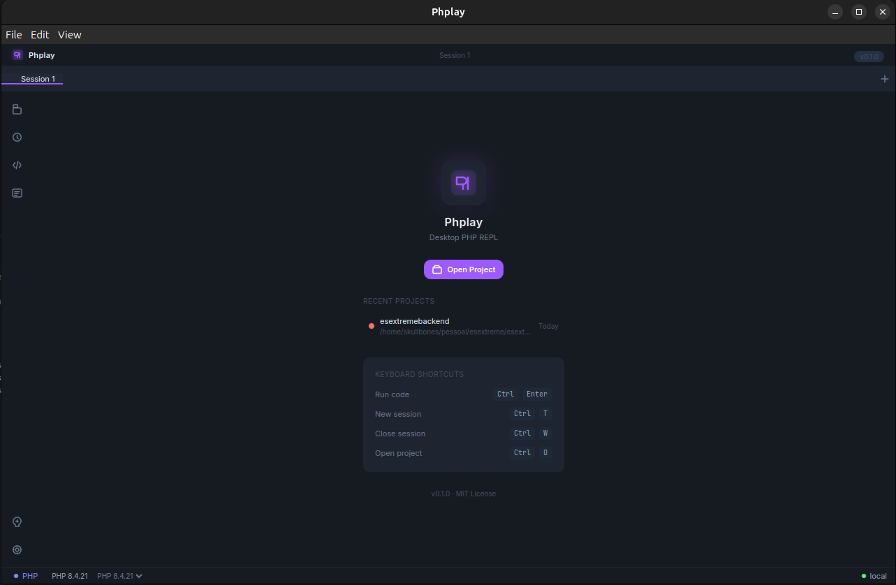

# Phplay

**The desktop PHP REPL built for real projects.**

Execute PHP snippets inside the full context of your Laravel, Symfony, or WordPress project — with autocomplete, structured output, AI assistance, and zero setup overhead.

[](https://opensource.org/licenses/MIT)
[](https://www.electronjs.org/)
[](https://vuejs.org/)
[](https://www.typescriptlang.org/)
[](#install)
[](https://github.com/rhaymisonbetini/Phplay/releases/latest)

[Features](#features) · [Screenshots](#screenshots) · [Install](#install) · [Getting Started](#getting-started) · [Architecture](#architecture) · [Contributing](#contributing)

---

### Install on Linux — one line

```bash
curl -fsSL https://raw.githubusercontent.com/rhaymisonbetini/Phplay/main/install.sh | bash
```

</div>

---

## What is Phplay?

Phplay is a native desktop application that turns your PHP project into an interactive playground. Instead of dumping to `dd()` or writing throwaway scripts, you open Phplay, point it at your project, and start executing PHP with your full application context — Eloquent models, facades, config, routes — all available out of the box.

Think of it as a cross between a PHP REPL, a scratchpad, and an AI-assisted debugging tool that actually understands your project.

---

## Features

### Core

- **Project-aware execution** — Runs PHP inside your real project bootstrap. `User::all()` just works in a Laravel project.
- **Automatic framework detection** — Detects Laravel, Symfony, and WordPress and applies the appropriate bootstrap automatically.
- **Smart structured output** — Arrays, objects, Eloquent models, collections, and exceptions are rendered as interactive, typed views — not a wall of `var_dump` text.
- **Cancellable execution** — Every run gets a UUID. Cancel long-running scripts mid-execution with one click.
- **Execution metrics** — Execution time (ms) and peak memory usage (KB/MB) shown after every run.

### Editor

- **Monaco Editor** — The same editor that powers VS Code, with PHP syntax highlighting and multi-cursor support.
- **Intelephense LSP** — Full PHP language server integration: completions, hover docs, signature help, and diagnostics.
- **Multi-session tabs** — Run multiple independent sessions per project. Switch, rename, and close tabs without losing your work.
- **History** — Every execution is saved. Browse, favorite, and reload past snippets (up to 500 entries per project).
- **Snippets** — Save frequently used code blocks and load them in one click.

### AI Assistant

- **Claude (Anthropic)** — Ask Claude to explain errors, suggest fixes, or generate snippets. Streaming responses, context-aware.
- **GPT (OpenAI)** — Alternative provider with the same interface. Switch between providers from settings.

### Developer Experience

- **Three built-in themes** — Dracula Neon (PHP purple), Midnight, and Nord. Switchable without restart.
- **Workspace isolation** — Every project gets its own storage, LSP cache, session history, and generated stubs.
- **Logs panel** — View application-level and LSP logs directly inside the app.
- **Laravel Discovery** — Reads `composer.json` and `composer.lock` to discover routes, artisan commands, installed packages, and models.

---

## Screenshots

<table>
  <tr>
    <td></td>
    <td>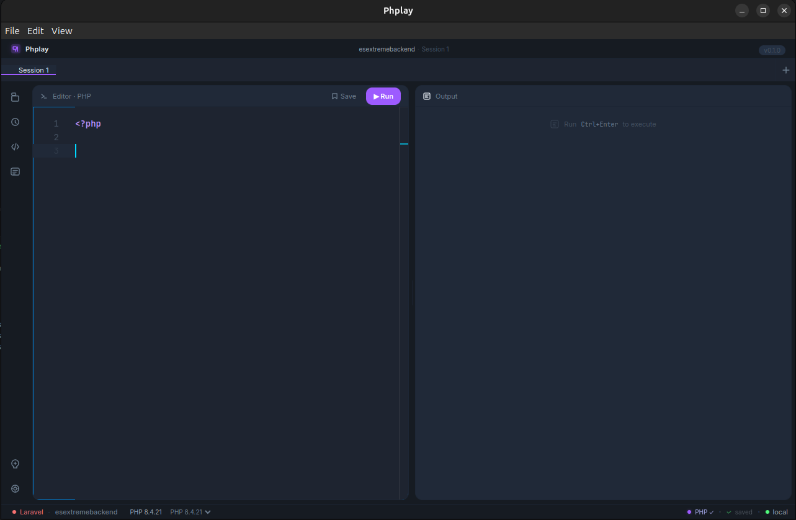</td>
  </tr>
  <tr>
    <td align="center"><b>Main interface</b></td>
    <td align="center"><b>Structured output</b></td>
  </tr>
  <tr>
    <td>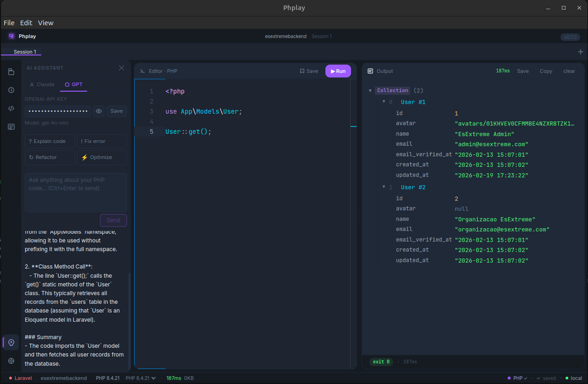</td>
    <td>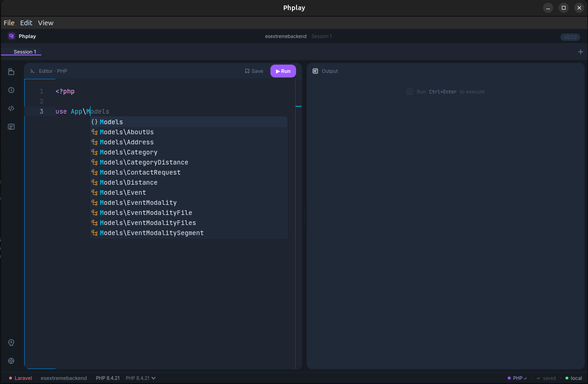</td>
  </tr>
  <tr>
    <td align="center"><b>AI Assistant (Claude / GPT)</b></td>
    <td align="center"><b>Laravel Discovery</b></td>
  </tr>
  <tr>
    <td>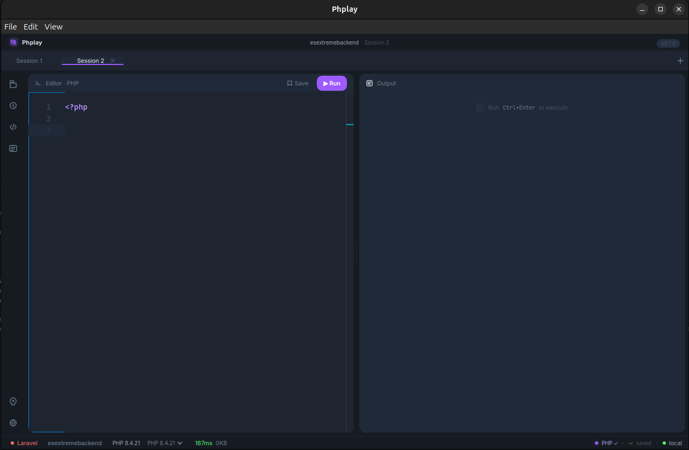</td>
    <td>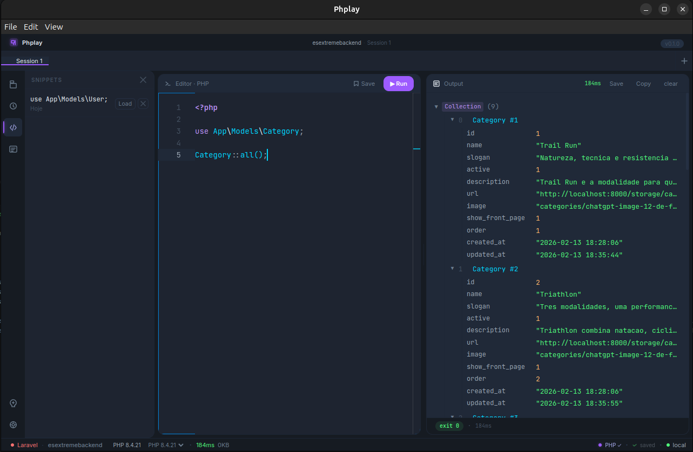</td>
  </tr>
  <tr>
    <td align="center"><b>Multi-session tabs</b></td>
    <td align="center"><b>Snippets manager</b></td>
  </tr>
  <tr>
    <td>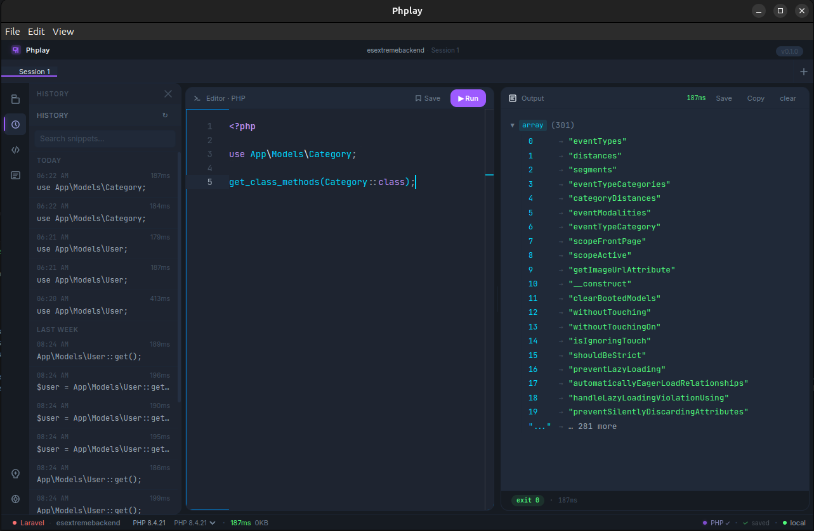</td>
    <td>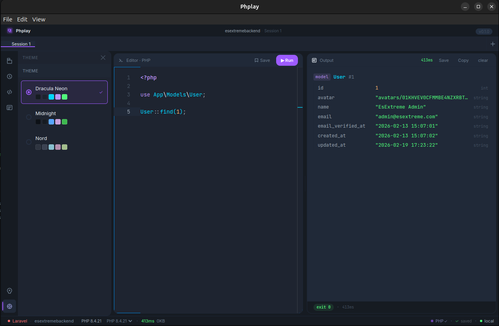</td>
  </tr>
  <tr>
    <td align="center"><b>Execution history</b></td>
    <td align="center"><b>Theme switcher</b></td>
  </tr>
  <tr>
    <td>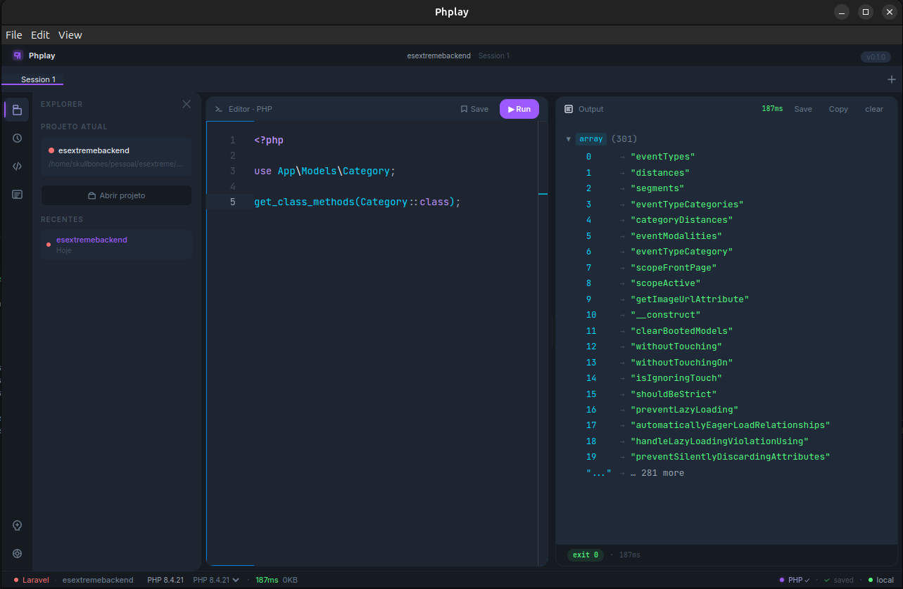</td>
    <td>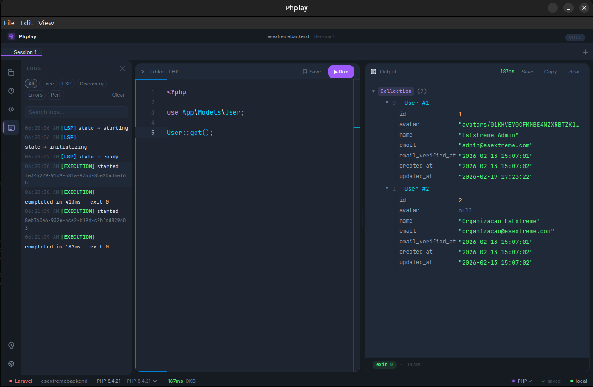</td>
  </tr>
  <tr>
    <td align="center"><b>Project explorer</b></td>
    <td align="center"><b>Logs panel</b></td>
  </tr>
</table>

<div align="center">
  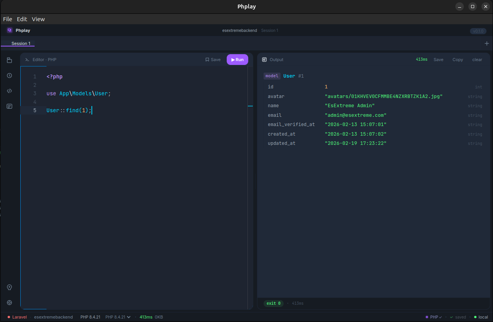
  <p><b>Eloquent model query rendered as a structured output view</b></p>
</div>

---

## Tech Stack

| Layer | Technology |
|---|---|
| Shell | [Electron 31](https://www.electronjs.org/) |
| Frontend | [Vue 3](https://vuejs.org/) + [Pinia](https://pinia.vuejs.org/) + [TypeScript 5.4](https://www.typescriptlang.org/) |
| Editor | [Monaco Editor 0.50](https://microsoft.github.io/monaco-editor/) |
| PHP Intelligence | [Intelephense 1.18](https://intelephense.com/) (LSP) |
| Build tool | [electron-vite 2](https://electron-vite.org/) |
| Styling | [Tailwind CSS v3](https://tailwindcss.com/) |
| Persistence | [electron-store](https://github.com/sindresorhus/electron-store) |
| Testing | [Vitest 1](https://vitest.dev/) + [@vue/test-utils](https://test-utils.vuejs.org/) |
| Fonts | JetBrains Mono (editor) · Inter (UI) |

---

## Getting Started

### Prerequisites

- **Node.js** 20 or higher
- **npm** 10 or higher
- **PHP** 8.1 or higher installed on your machine (Phplay uses your system PHP — it does not bundle one)
- Git

> **Tip:** Use [phpenv](https://github.com/phpenv/phpenv) or [mise](https://mise.jdx.dev/) to manage PHP versions.

### 1. Clone the Repository

```bash
git clone https://github.com/rhaymisonbetini/Phplay.git
cd Phplay
```

### 2. Install Dependencies

```bash
npm install
```

### 3. Start the Development Server

```bash
npm run dev
```

This launches the Electron app with Vite hot-module replacement. Changes to the renderer are reflected instantly; changes to the main process require an app restart.

---

## Install

### Linux — one line

```bash
curl -fsSL https://raw.githubusercontent.com/rhaymisonbetini/Phplay/main/install.sh | bash
```

The script:
- Checks your architecture (x64) and installs FUSE if missing
- Downloads the latest `.AppImage` from the [Releases](https://github.com/rhaymisonbetini/Phplay/releases) page
- Makes it executable and places it in `~/.local/bin/phplay`
- Creates a `.desktop` entry so Phplay appears in your application launcher

> **Requires PHP 8.1+** on your system. Phplay uses your local PHP — it does not bundle one.

**Uninstall:**
```bash
rm ~/.local/bin/phplay.AppImage ~/.local/bin/phplay ~/.local/share/applications/phplay.desktop
```

---

### Manual Download

Pre-built binaries on the [Releases](https://github.com/rhaymisonbetini/Phplay/releases/latest) page.

| Format | Description |
|---|---|
| `.AppImage` | Portable — works on any Linux distro |
| `.deb` | Debian / Ubuntu / Linux Mint |

---

## Building from Source

```bash
# Type-check + build all processes
npm run build

# Package for Linux
npm run build:linux   # → dist/*.AppImage, dist/*.deb
```

The packaged output lands in `dist/`.

---

## Architecture

### Project Structure

```
phplay/
├── src/
│   ├── main/                      # Electron main process (Node.js)
│   │   ├── index.ts               # Entry point — creates BrowserWindow
│   │   ├── ipc/
│   │   │   └── handlers.ts        # All ipcMain.handle() registrations
│   │   ├── executor/
│   │   │   ├── PhpExecutionService.ts   # Execution lifecycle, cancellation, UUID tracking
│   │   │   ├── LocalExecutor.ts         # Spawns php process, captures stdout/stderr
│   │   │   └── types.ts                 # ExecutionContext, ExecutionResult, Executor
│   │   ├── runtime/
│   │   │   ├── SmartPhpRuntime.ts       # Wraps code for structured JSON output
│   │   │   └── SmartOutputRenderer.ts   # Parses __PHPLAY_OUTPUT__ protocol
│   │   ├── lsp/
│   │   │   ├── IntelephenseLsp.ts       # JSON-RPC client for Intelephense
│   │   │   ├── LanguageServerManager.ts # Per-workspace LSP instance manager
│   │   │   └── types.ts                 # LanguageServerState state machine types
│   │   ├── project/
│   │   │   ├── FrameworkDetector.ts     # Detects Laravel / Symfony / WordPress / plain
│   │   │   ├── LaravelBootstrap.ts      # Generates bootstrap wrapper for Laravel
│   │   │   └── PlainPhpWrapper.ts       # Wraps plain PHP scripts
│   │   ├── laravel/
│   │   │   ├── LaravelDiscoveryService.ts  # Reads routes, commands, models
│   │   │   ├── ComposerMetadataReader.ts   # Parses composer.json / composer.lock
│   │   │   ├── LaravelStubGenerator.ts     # Generates Intelephense-compatible PHP stubs
│   │   │   └── ArtisanRunner.ts            # Runs artisan with timeout
│   │   ├── workspace/
│   │   │   └── WorkspaceService.ts      # SHA-256 workspace ID + per-project storage layout
│   │   ├── ai/
│   │   │   ├── ClaudeClient.ts          # Streaming Anthropic API client
│   │   │   └── GptClient.ts             # Streaming OpenAI API client
│   │   ├── history/
│   │   │   └── HistoryService.ts        # Read/write execution history (max 500)
│   │   ├── snippets/
│   │   │   └── SnippetService.ts        # Named code snippet CRUD
│   │   ├── php/
│   │   │   └── PhpDetector.ts           # Finds PHP binaries on the system
│   │   └── storage/
│   │       └── Logger.ts                # File-based logger with rotation
│   │
│   ├── preload/
│   │   ├── index.ts               # Exposes window.electronAPI via contextBridge
│   │   └── index.d.ts             # TypeScript types for the bridge
│   │
│   └── renderer/                  # Vue 3 frontend
│       └── src/
│           ├── App.vue            # Root component — layout, IPC wiring
│           ├── main.ts            # Vue bootstrap
│           ├── components/
│           │   ├── PhplayEditor.vue        # Monaco editor + LSP provider registration
│           │   ├── OutputPanel.vue         # Renders structured + plain output
│           │   ├── SplitPane.vue           # Resizable editor/output panels
│           │   ├── SidebarRail.vue         # Icon rail (Explorer, History, Snippets…)
│           │   ├── SidebarPanel.vue        # Active panel content
│           │   ├── SessionTabBar.vue       # Multi-session tab management
│           │   ├── AppTitleBar.vue         # Custom title bar + logo
│           │   ├── AppStatusBar.vue        # PHP version, LSP state, execution metrics
│           │   ├── CommandPalette.vue      # Ctrl+Shift+P command palette
│           │   └── sidebar/
│           │       ├── AISidebar.vue       # Claude / GPT chat interface
│           │       ├── HistorySidebar.vue  # Browsable execution history
│           │       ├── SnippetsSidebar.vue # Saved snippets panel
│           │       ├── ThemeSidebar.vue    # Theme picker
│           │       └── LogsSidebar.vue     # In-app log viewer
│           ├── theme/
│           │   ├── dracula-neon.ts   # PHP purple theme (default)
│           │   ├── midnight.ts       # Deep dark blue theme
│           │   ├── nord.ts           # Arctic blue theme
│           │   └── theme-provider.ts # Applies CSS custom properties at runtime
│           └── assets/
│               ├── main.css          # CSS custom properties + base styles
│               └── animations.css    # Keyframe animations
│
├── tests/                         # Vitest test suites
├── resources/                     # App icons
├── electron.vite.config.ts
├── electron-builder.yml
├── tailwind.config.js
└── package.json
```

### How Execution Works

```
User clicks Run
       │
       ▼
PhpExecutionService.run(code, context)
  ├── assigns executionId (UUID)
  ├── SmartPhpRuntime wraps code:
  │     • Plain PHP  → PlainPhpWrapper (adds error reporting, output buffering)
  │     • Laravel    → LaravelBootstrap (require vendor/autoload.php, bootstrap/app.php,
  │                     hoist use statements above bootstrap, handle facades)
  │     • Symfony    → vendor/autoload.php + Kernel boot
  │     └── WordPress → wp-load.php
  │
  ├── LocalExecutor spawns: php -r "<wrapped_code>"
  │     stdout chunks → ipcMain sends execution:output events → renderer appends live
  │
  └── SmartOutputRenderer parses stdout:
        • Lines prefixed __PHPLAY_OUTPUT__: → parsed as structured JSON
        • All other lines → plain text chunks
        → OutputPanel renders typed views (model, array, exception, etc.)
```

### LSP State Machine

The Intelephense language server follows a typed state machine per workspace:

```
stopped ──→ starting ──→ initializing ──→ ready
                │                            │
                └──────── error ←────────────┘
                              │
                          restart → starting
```

The status bar reflects this state in real time: a spinner during `initializing`, `PHP ✓` when `ready`, and a clickable `LSP error` badge with a restart button on failure.

### Workspace Isolation

Every project gets a deterministic workspace ID derived from its real path:

```
workspaceId = SHA-256(realpath(projectPath)).slice(0, 16)

{userData}/
  workspaces/
    {workspaceId}/
      sessions.json       ← tab state
      history.json        ← execution history
      snippets.json       ← saved snippets
      laravel-metadata.json
      lsp-cache/          ← Intelephense index (isolated per project)
      generated/          ← PHP stubs for facades & models
  logs/
    lsp.log
    main.log
```

Two different projects never share cache, history, or LSP state.

### Theme System

Themes are TypeScript objects that define CSS custom property maps. At startup, `theme-provider.ts` calls `document.documentElement.style.setProperty()` for each token — applying them as inline styles, which take precedence over any `:root` CSS declarations. Tailwind's `accent` color scale is also updated in `tailwind.config.js` so utility classes like `bg-accent` and `text-accent` stay in sync.

---

## Available Scripts

| Command | Description |
|---|---|
| `npm run dev` | Start Electron + Vite dev server with HMR |
| `npm run build` | Typecheck + build all processes |
| `npm run build:linux` | Package for Linux (AppImage + deb) |
| `npm run build:linux` | Package for Linux (AppImage + deb) |
| `npm run typecheck` | Run `vue-tsc` + `tsc` on all tsconfigs |
| `npm run lint` | ESLint all JS/TS/Vue files (auto-fix) |
| `npm run format` | Prettier format all files |
| `npm run test` | Run Vitest test suite once |
| `npm run test:watch` | Run Vitest in watch mode |

---

## Testing

```bash
# Run all tests
npm run test

# Watch mode
npm run test:watch
```

Tests live in `src/main/*/__tests__/` alongside the modules they test.

**Coverage areas:**

| Module | Tests |
|---|---|
| `IntelephenseLsp` | JSON-RPC framing, response dispatch, pending request timeout |
| `pathToUri` | Spaces, unicode, `#`, `%` in paths |
| `SmartOutputRenderer` | All output types: model, array, collection, exception, float, null |
| `SmartPhpRuntime` | Code wrapping, `use` statement hoisting |
| `FrameworkDetector` | Laravel, Symfony, WordPress, plain detection from fixtures |
| `PhpExecutionService` | Run lifecycle, cancellation by ID, timeout |
| `RecentProjects` | Add, remove, dedup, max-length cap |

---

## AI Assistant Setup

Phplay ships with a built-in AI chat panel (Claude and GPT). Keys are stored locally in `{userData}/ai-config.json` and never leave your machine.

To configure:

1. Open the **AI** panel from the sidebar rail
2. Click the settings icon
3. Enter your **Anthropic API key** (for Claude) and/or **OpenAI API key** (for GPT)

The AI assistant has context about your current code and last execution error, so you can ask it to explain exceptions or suggest fixes without copy-pasting.

---

## Keyboard Shortcuts

| Shortcut | Action |
|---|---|
| `Ctrl+Enter` | Run current code |
| `Ctrl+Shift+P` | Open command palette |
| `Ctrl+S` | Save current session |
| `Esc` | Cancel running execution |
| `Ctrl+Tab` | Switch to next session tab |

---

## Troubleshooting

### PHP not detected

Phplay scans common paths (`/usr/bin/php`, `/usr/local/bin/php`, Homebrew paths, etc.). If your PHP is in a non-standard location:

1. Open the status bar PHP indicator at the bottom
2. Click **Configure PHP** to provide a custom path

### Intelephense shows "LSP error"

Click the `LSP error` badge in the status bar to see the error message and restart the server. If it persists, check `{userData}/logs/lsp.log`.

Find `{userData}` at:
```
~/.config/phplay/
```

### Laravel autocomplete not working

Ensure your project has a `vendor/` directory (`composer install` must have been run). The LSP indexes `vendor/` at startup — the status bar will show `Indexando…` while this is in progress.

### App won't start after update

Clear the Electron cache:
```bash
rm -rf ~/.config/phplay/
```

---

## Contributing

Contributions are welcome. Please open an issue first to discuss significant changes.

```bash
# Fork → clone → branch
git checkout -b feat/my-feature

# Install dependencies
npm install

# Dev loop
npm run dev

# Before submitting
npm run typecheck
npm run lint
npm run test
```

### Branch Conventions

| Prefix | Use |
|---|---|
| `feat/` | New feature |
| `fix/` | Bug fix |
| `refactor/` | Internal cleanup |
| `test/` | Test-only changes |
| `docs/` | Documentation |

---

## License

MIT © [rhaymisonbetini](https://github.com/rhaymisonbetini)

---

<div align="center">
  <sub>Built with PHP purple and a lot of <code>var_dump</code> frustration.</sub>
</div>
